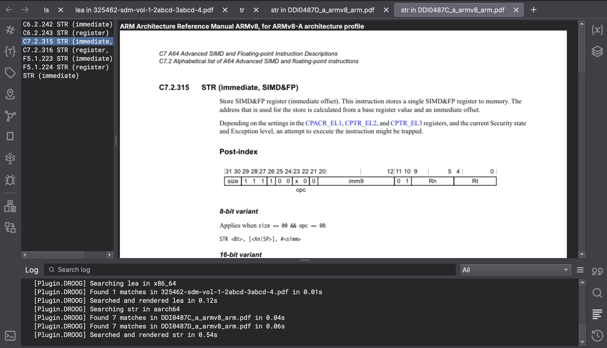

P**D**F **R**eference **O**pcodes **O**r re**G**isters.  Like IDA's [FRIEND](https://github.com/alexhude/FRIEND#readme)/[AMIE](https://github.com/NeatMonster/AMIE) or Ghidra's "Processor Manual..." right-click menu. 

# Usage

This is a glorified PDF search for tokens that show up in tables of contents.

Select a token like an instruction or a register, and "Plugins" -> "DROOG" -> "Search Reference Headings..." will show pages from PDFs available for the current architecture. Click an image to open the PDF at that page in your browser.

For unfamiliar architectures, bind the search to a hotkey. There's also a command to peek at table of contents headings in the status bar for quickly reviewing mnemonics.

If you're dealing with raw coprocessor operand values or unnamed MMIO offsets, you'll need to:

1. Dig up the *right* PDFs for your SoC or peripheral. Rip relevant tables into a Python `dict`.
2. Bulk-name relevant values or instructions with a script. (You can use comments as a single "token".)

# Setup

Instead of hardcoding documentation, local reference manuals are indexed with [MuPDF](https://mupdf.com/) (hence AGPLv3 licensing) and opened directly. Install via whatever `pip install pymupdf` looks like in your BN Python env.

You can dump your PDF collection in `droog/manuals/{arch}/*.pdf`, or include them anywhere in your plugin's directory structure if it's installed to the same plugin folder as DROOG and predictably named. Endianness and 32/64-bit indicators on `arch` are stripped off with a regex, so `aarch64` is in `manuals/aarch/*.pdf` and `x86_64` lives in `manuals/x86/*.pdf`. It's weird but simplifies dealing with MIPS/ARMv7/etc.

If you're reversing ancient fauna based on scans with beautiful typesetting but terrible OCR and no table of contents, you can edit in your own ToC with MuPDF's [Document.set_toc()](https://pymupdf.readthedocs.io/en/latest/document.html#Document.set_toc). Check the `*.idx` files in the [Ghidra repo](https://github.com/NationalSecurityAgency/ghidra) in case American taxpayers already indexed one for you!